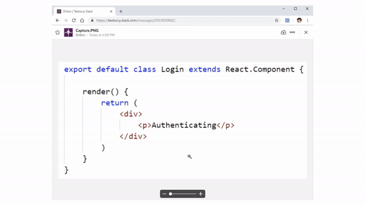

# Textocry - Copy Text from Images

[](https://github.com/rinormaloku/textocry/blob/master/LICENSE.txt)

[Textocry](https://chrome.google.com/webstore/detail/textocry/ehbaclllinljjcopfnpmmodcjoodmahl) is a chrome extension to copy text from images using the best open source OCR engine [Tesseract.js](https://github.com/naptha/tesseract.js).

As a developer you don't always find the code in text format, quite often it's another one:
* Video format - youtube / pluralsight tutorial.
* Image format - from lazy friends or lazy bloggers.

In every instance you need to write it down character by character.
Using Textocry you can just select the area with the text and let Tesseract extract the text, as shown below.



## Using Textocry

Once installed from [Chrome Webstore](https://chrome.google.com/webstore/detail/textocry/ehbaclllinljjcopfnpmmodcjoodmahl), the usage is simple:

1. Click the icon .
2. Crop the area containing the text.
__Wait until Tesseract recognizes the text... and done!__
3. The text is in your clipboard. `Ctrl + V` to paste it!

## Building Textocry

Once you clone the codebase in the root directory execute:
```bash
$ npm install
$ npm run webpack
```
Webpack will bundle the Javascript files into `./dist/main.js` which will be used as starting point for the extension.

### Loading Textocry into the browser

1. Enter in the Address bar `chrome://extensions`.
2. Click `Load unpacked` and select the root folder.

Done!

## Credits

This tool is build with help of:
* Tesseract.js - does the actual OCR:
* @simo - creater of the [Screenshot Capture](https://github.com/simov/screenshot-capture) extension, used as a starting point for our codebase.  

## Feedback

* Request features or file bugs on [GitHub](https://github.com/rinormaloku/textocry/issues/new).
* Write in our [Google Group](https://groups.google.com/forum/#!forum/textocry).
* [Tweet](https://twitter.com/rinormaloku) me about any other feedback.

## License

Copyright (c) 2018-present Rinor Maloku.

Licensed under the [MIT](LICENSE.txt) License.
